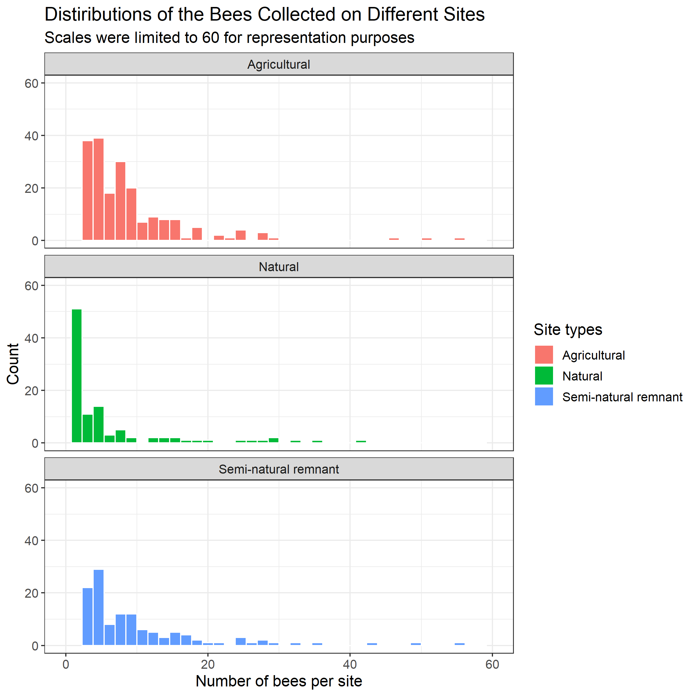
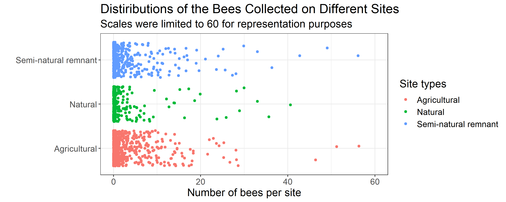

```{r setup, include=FALSE}
knitr::opts_chunk$set(echo = TRUE)
library(tidyverse)
library(testthat)
library(tidyverse)
library(broom)
library(knitr)
library(kableExtra)
library(docopt)
```

```{r load analysis results, include=FALSE}
results <- readRDS("../results/analysis_results.rds")
```

## 1. Introduction

Bumble bee population are experiencing rapid decline in North America. In the last 20 years, certain bumble bee species abundance decreased by 96% across the United States [@cameron2011patterns]. This phenomenon is not limited to North America, European bee colonies also experience collapses and sudden bee deaths [@bacandritsos2010sudden; @scheper2014museum]. Researchers proposed a variety of associations and causes ranging from pesticide use [@henry2012common], to mite infestation [@brettell2017oldest], as all as habitat loss and climate change. The status of bee population health, diversity and abundance remains an important topic.

### 1.1. Dataset

This report analyzes the Bumble Bee Diversity and Abundance Survey conducted by the Ministry of Environment, Conservation and Parks of Ontario. The data was collected between 2015-2017 in 67 locations across Southern Ontario, as can be explored in this map: [view](https://data.ontario.ca/dataset/bumble-bee-diversity-and-abundance-survey). The dataset is accessible on the Ontario Open data website: [view](https://data.ontario.ca/dataset/bumble-bee-diversity-and-abundance-survey). The surveyors recorded multiple variables including bee species, bee types, county names and flowers found on the site. The dataset description did not provide information regarding collection methodology. This project assumes the surveyors collected data using random sampling in a manner that is representative of the bee population in that region.

```{r map, echo=FALSE, fig.cap="Figure 1.Map of bee sites for sample collection", fig.height=10, fig.width=10, out.width="85%"}
knitr::include_graphics("../src/figures/Bumblebee_survey_area.png")
```


*Source: Image from interactive map of Bumble Bee Diversity and Abundance Survey [website](http://www.moegisportal.ca/agol/AccessibleViewer/index.html?appid=e38703b018ff4e3ca09f2878879a4e34)*


### 1.2. Research question

The analysis aims to determine the differences in bee counts between sites:

-   Agricultural
-   Natural
-   Semi-natural remnant

**Null hypothesis**: The bee count values are not different between all pairs of agricultural, natural and semi-natural remnant sites in Southern Ontario.  
**Alternative hypothesis**: The bee count values are different between all pairs of agricultural, natural and semi-natural remnant sites in Southern Ontario.

## 2. Exploratory data analysis

The following histogram shows the distributions of the bumble bee collected from different types of site. The distributions are highly right-skewed. The x axis of the following histogram was limited to 60 to show the shape of the distribution.

```{r plot_1_hist_bee_distribution, echo=FALSE, fig.cap="Figure 2. The distribution of bee counts at each site type", fig.height=10, fig.width=10, out.width="80%"}

```

The following violin plot shows not only the distribution of the number of bees but also the mean and median. The mean is shown as white dots, while the median is shown as black dots. In order to include all the data points, log scale was applied to the x-axis of the plot.

```{r plot_2_violin_mean_median, echo=FALSE, fig.cap="Figure 3. The distribution of bee counts with the mean and median", fig.height=10, fig.width=10, out.width="80%"}

```

The below figure shows the jitter plot for the number of bees collected at each site. The hypothesis testing would be required to find out whether the number of bees collected at each site is different from one another.

```{r plot_3_jitter, echo=FALSE, fig.cap="Figure 4. The distribution of the bees collected on different sites", fig.height=10, fig.width=10, out.width="100%"}

```

The histograms and the violin plots show that the data is skewed to the right because most counts are zero. Even if the response variable was continuous (e.g. weight instead of count), using means would not be appropriate since the data is skewed.

Initially, the approach was to use grouped data by site id. This approached yielded more counts as the rows were summed. However, it was the wrong approach as each observation should be treated independently since they are independent and random observations.

The GPS coordinates were omitted the project is not looking at specific locations but the rather location types. Other features like species names were also omitted as this project aims to look at site types. If our group has a domain expert, it would be useful to also analyze species types and bee types. Without an expert it is impossible to interpret outcomes of more specific analysis since we do not know which species are more common or which bee types are more common.

**Data quality**

We assume the data was collected in a way that is unbiased and generalizable to the Southwestern Ontario region. The dataset was collected by the Ministry of Environment, Conservation and Parks of Ontario, so it is likely they used randomized sampling techniques.

All of the data was collected between May and August each year between 2015 and 2017. As a result, data collection controls for seasons (i.e. all site types are visited during same time periods, rather than having one site type visited in the fall and one in the summer).

## 3. Methodology

In this project, all possible relationships will be analyzed:

-   Agricultural vs natural
-   Agricultural vs semi-natural remnant
-   Natural vs semi-natural remnant

Poisson regression model and the zero-inflation model are two candidates for modeling the relationship between counts and site types.

Counts is a discrete variable making Anova and permutation tests using means or medians inappropriate to use. According to [@roback2021beyond], Poisson regression is a suitable model for this problem because it is typically used to model counts per unit of space or time. This is the case with the bee count survey. The parameter of interest is $\lambda_i$ which is the average number of bees per unit of space. The formula for this model is: $log(\lambda_i = \beta_0 + \beta_1x_i)$

[@roback2021beyond] describe the following assumptions:

><font size="2.5">1. Poisson Response: The response variable is a count per unit of time or space, described by a Poisson distribution.<br>
> 2.  Independence: The observations must be independent of one another. <br>
> 3.  Mean=Variance: By definition, the mean of a Poisson random variable must be equal to its variance. <br>
> 4.  Linearity: The log of the mean rate, $log(\lambda_i)$, must be a linear function of $x$.</font>

*Source: Direct quote from @roback2021beyond*

The four assumptions are assessed in our dataset and we conclude the below:

1.  The bee survey dataset satisfies the first assumption the number of bees is a count variable per unit of space (and time).  
2.  We do not know how the samples have been collected but it is very plausible they were collected independently.  
3.  We assume that the count of bees (in the population) has equal mean and variance.
4.  We assume that the average number of bees per unit of space and time has a linear relationship with the site type.

Given the limited knowledge about this dataset, we will proceed with the Poisson regression model.

Tools used for the analysis include R[@R], tidyverse[@tidyverse], knitr[@knitr].

**Sidenote:** The zero-inflation model is likely an even more suitable model for this dataset. However, it is more difficult to interpret and understand how to use it appropriately as our team does not have experience with this type of modelling. Zero-inflation model is used when a large number of counts is zero, which is the case in this dataset.

## 4. Results

```{r include=FALSE}
alpha <- 0.05
```

To compare the differences in bee counts between site types, a significance level $\alpha$ $=$ `r alpha` is used to evaluate the p-values of the Poisson regression test of the three pairs of baseline and response variables. We can see the results of the test in Table 2 below.

### 4.1 Evaluation of p-value

The p-values of the site type pairs Agricultural and Semi-natural remnant, as well as the pair Natural and Semi-natural remnant, which are `r results$p_rounded[2]` and `r results$p_rounded[3]` respectively as shown in the below Table 2. They are both smaller than `r alpha`. Therefore, we have evidence to reject the null hypothesis for only two pairs of site types, meaning that the bee count values are different between agricultural and semi-natural remnant, as well as natural and semi-natural remnant sites in Southern Ontario.

However, for the pair Agricultural and Natural, the p-value is `r results$p_rounded[1]`, which is larger than `r alpha`. Therefore, we accept the null hypothesis that the bee count values are not different between agricultural and natural remnant sites in Southern Ontario.

### 4.2 Evaluation of coefficients

Since this is a log linear regression, the coefficients were converted (*e* to the power of estimated coefficient) and stored in the `coeff` column for easier interpretation.

The coefficients of site types also indicate that there is a difference between the two pairs of site types Agricultural and Semi-natural remnant. The mean count for Semi-natural remnant is `r results$coeff[2]` times higher than Agricultural. The same applies to the Natural and Semi-natural remnant pair, where Semi-natural mean count is `r results$coeff[3]` times higher.

However, the coefficient of the pair of site types Agricultural and Natural sites is `r results$coeff[1]`, which shows that there is minor difference between the pair.

### 4.3 Conclusion

Both the p-values and coefficients lead to the same conclusion.

1.  We can only reject the null hypothesis for two pairs of site types Agricultural and Semi-natural remnant, as well as the pair Natural and Semi-natural remnant. We can conclude that it is statistically significant that the bee counts are different between site type pairs Agricultural and Semi-natural remnant, as well as the pair Natural and Semi-natural remnant in Southern Ontario.

2.  For the pair of site types Agricultural and Natural remnant, it is not statistically significant that the bee counts are different.

```{r analysis results, echo=FALSE, message=FALSE, warning=FALSE}
kable(results[,!names(results) %in% c("p.value")], caption = "Table 1. Analysis results",
      col.names = c("Site type pairs",
                    "Estimate",
                    "Standard error",
                    "Statistic",
                    "p-value (rounded)",
                    "Coefficient")) |>
  kable_styling(full_width = FALSE, position = "left")
```

## 5. Discussion

The study would benefit from further analysis of Semi-natural remnant type characteristics. Currently, the information is lacking in regards to what makes these sites more attractive to the bees. One explanation could be that the agricultural sites have mono-cultural crops that may or may not be attractive. Pesticide use could also be a factor. It is also unclear how "natural" the Natural site type is given the highly developed landscape of Southern Ontario. Human activities have disturbed and fragmented habitats. A Semi-natural site could potentially have more plant diversity if the plants are planted deliberately, for example.

### 5.1 Future directions

The zero-inflation analysis found that all counts are significantly different. However, we lack expertise to draw conclusion from this analysis because zeros are treated as a separate part of the test analysis using the `pscl` package function `zeroinfl`. It would be useful to come back to this problem and see if it can be reevaluated with a zero-inflation model. More information can be found in the Jupyter notebook file containing the literate code for this project (sections 4.3 and 5.3): [view](https://github.com/UBC-MDS/DSCI_522_Bee_Count_Comparison_Group_26/blob/main/src/literate_code/main_literal_code_analysis.ipynb).

## References
