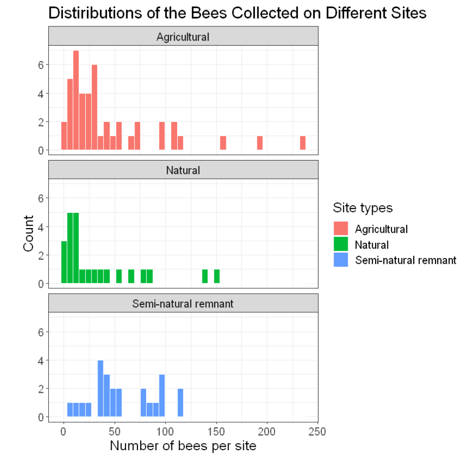
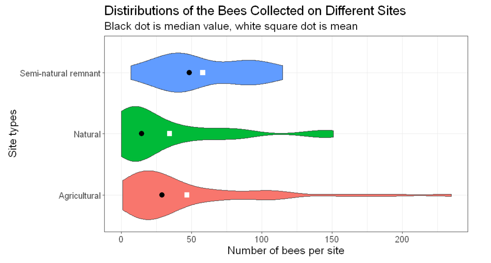

Exploratory Data Analysis of the Bumble Bee Data Set
================

# Summary of the data set

The data set used in this project is the bumble bee data set prepared by the Ministry of the Environment, Conservation and Parks. This project was started to characterize the number of species of bumble bees and the relative abundances of these species. The bumble bees were collected from 67 locations in southwestern Ontario to compare the diversity of bees occuring in agricultural and more natural areas.

**Figure 1**. Bumble bee survey areas.

The original data includes vast information about the survey sites and kinds of bumble bees. Some of the data includes:
- sampling locations, including GPS coordinates and the county name
- the number of bumble bee individuals sampled at each site, listed for each species and for each caste of a species (queen, worker, male)
- other site details, such as the date of the site visit

# Preprocessing of the original data set

Since the original data set contains vast amount of data, it needed to be preprocessed to make it more effective for analysis. The preprocessing of the data was carried out with the following approaches:
- omit the GPS coordinates
- sum the number of bumble bee regardless of the species
- categorize the locations as agricultural, natural, and semi-natural  areas

The table below shows the number of each site where bumble bees were sampled.

| Agricultural Area | Natural Area |  Natural Area |
| ----------------: | -----------: | ------------: |
|          45       |           24 |            24 |

# Exploratory analysis on the training data set

The following histogram shows the distributions of the bumble bee collected from different types of site. The distributions are right-skewed, indicating that the median should be also used for comparing the numbers. 

**Figure 2**. The distribution of bee counts at each site type

The following violin plot shows not only the distribution of the number of bees but also the mean and median. The mean is shown as white dots, while the median is shown as black dots.

**Figure 3**. The distribution of bee counts with the mean and median

# References

"Bumble Bee Diversity and Abundance Survey" by The Ministry of the Environment, Conservation and Parks. <https://data.ontario.ca/dataset/bumble-bee-diversity-and-abundance-survey>.

